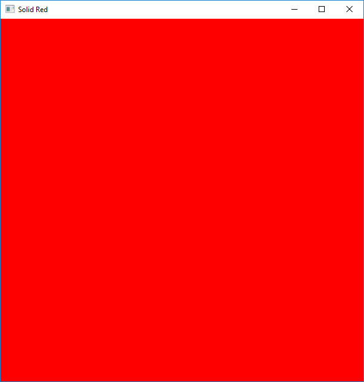

# OpenGL Superbible - Rust Examples

This is my repository for keeping the OpenGL examples as I work through 
the OpenGL Superbible's 7th edition in rust.

- Example Images
    - [Solid Red](#solid-red)
    - [Colors](#colors)
    - [Point](#point)
    - [Triangle](#triangle)
    - [Moving Triangle](#moving-triangle)
    - [Colored Triangle](#colored-triangle)
    - [Tessellated Triangle](#tessellated-triangle)
    - [Geometry Shader](#geometry-shader)
    - [Fragment Shader](#fragment-shader)
    - [Interpolation](#interpolation)
    - [Spinny Cube](#spinny-cube)
    - [Spinny Cubes](#spinny-cubes)
    - [Textured Triangle](#textured-triangle)
    - [KTX Viewer](#ktx-viewer)
    
> More examples are available than the ones listed in the readme. Storing a lot of gifs would bloat the repo, so only a few are displayed here.

## Instructions

To run any of the programs:

    cargo run --bin name

## Images

### Solid Red

### Colors

### Point

### Triangle 

### Moving Triangle 

### Colored Triangle 

### Tessellated Triangle 

### Geometry Shader

### Fragment Shader

### Interpolation

### Spinny Cube

### Spinny Cubes

### Textured Triangle

### KTX Viewer

> This gif has artifacts from the method used to generate it but you get the idea.

## Completion

- [x] alienrain
- [ ] basicfbo
- [ ] bindlesstex
- [ ] blendmatrix
- [ ] blinnphong
- [ ] bumpmapping
- [ ] clipdistance
- [ ] compressrgtc
- [ ] csflocking
- [ ] cubemapenv
- [ ] cubicbezier
- [ ] cullindirect
- [ ] deferredshading
- [ ] depthclamp
- [ ] dflandscape
- [ ] dispmap
- [ ] dof
- [ ] envmapsphere
- [ ] equirectangular
- [ ] fontdemo
- [ ] fragcolorfrompos
- [x] fragmentlist
- [x] grass
- [ ] gsculling
- [ ] gslayered
- [ ] gsquads
- [ ] gstessellate
- [ ] hdrbloom
- [ ] hdrexposure
- [ ] hdrtonemap
- [ ] hqfilter
- [ ] indexedcube
- [ ] indirectmaterial
- [x] instancedattribs
- [ ] julia
- [x] ktxview
- [ ] linesmooth
- [x] mirrorclampedge
- [x] movingtri
- [ ] msaanative
- [x] multidrawindirect
- [ ] multimaterial
- [ ] multiscissor
- [ ] multiviewport
- [ ] noperspective
- [ ] normalviewer
- [ ] objectexploder
- [ ] ompparticles
- [ ] packetbuffer
- [ ] perpixelgloss
- [ ] phonglighting
- [ ] pmbfractal
- [ ] pmbstreaming
- [ ] polygonsmooth
- [ ] prefixsum
- [ ] prefixsum2d
- [ ] programinfo
- [ ] raytracer
- [ ] rimlight
- [ ] sampleshading
- [ ] sb6mrender
- [ ] sdfdemo
- [ ] shadowmapping
- [ ] shapedpoints
- [x] simpleclear
- [x] simpletexcoords
- [x] simpletexture
- [x] singlepoint
- [x] singletri
- [ ] sparsetexture
- [x] spinnycube
- [ ] springmass
- [ ] ssao
- [ ] starfield
- [ ] stereo
- [ ] subroutines
- [ ] tessellatedcube
- [ ] tessellatedgstri
- [x] tessellatedtri
- [ ] tessmodes
- [ ] tesssubdivmodes
- [ ] toonshading
- [x] tunnel
- [x] wrapmodes
